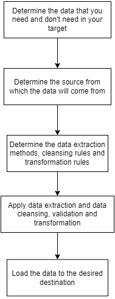

# ETL (Extract, Transform, Load) 🗒️

<!-- TABLE OF CONTENTS -->

  
Table of Contents

  <ol>
    <li><a href="#extract">Extract</a></li>
    <li><a href="#transform">Transform</a></li>
    <li><a href="#load">Load</a></li>
    <li><a href="#benefits-and-challenges-of-etl">Benefits and challenges of ETL</a></li>
    <li><a href="#other-integration-methods">Other integration methods</a></li>
    <li><a href="#etl-pipeline">ETL Pipeline</a></li>
    <li><a href="#references">References</a></li>
  </ol>

ETL is a process that extracts, transforms, and loads data from multiple sources to a data warehouse or other unified data repository. 

ETL provides the foundation for data analytics and machine learning workstreams. Through a series of “business” rules, ETL cleanses and organizes data in a way that addresses specific business intelligence needs,  e.g monthly reporting. ETL is often used by an organization to:

- Extract data usually from legacy systems (A legacy system is an informatics system that is antique but is still being used) or from other sources.
- Cleanse the data to improve data quality and establish consistency
- Load data into a target database

In short, the ETL process allows leaving the data in the desired format.

Now, we will talk about what happens in each step of the ETL process.

## Extract

During extraction, raw data is copied or exported from source locations to a staging area. This data can be extracted from a variety of data sources, which can be structured or unstructured. Those sources include but are not limited to:

- SQL or NoSQL servers
- CRM (Customer Relationship Management) and ERP (Enterprise Resource Planning) systems
- Flat files
- Email
- Web pages

There exist three data extraction methods:

1. Full extraction
2. Partial extraction without update notification
3. Partial extraction with an update notification

Independent of the methods used, extraction should not affect the performance and response time of the source systems. These source systems are live production databases (So not legacy systems all the time).

## Transform

In the staging area, the raw data undergoes data processing. Here, the data is transformed and consolidated for its intended analytical use case. This phase can involve the following tasks.

- Filtering, cleansing, de-duplicating, validating and authenticating the data.
- Performing calculations, translations, or summarizations based on the raw data. This can include changing row and column headers for consistency, converting currencies or other units of measurement, editing text strings, and more. i.e Homogenizing the data.
- Conducting audits to ensure the quality and compliance of the data.
- Removing, encrypting, or protecting sensible data.
- Formatting the data into data tables or joined tables to match the schema of the target data warehouse

## Load

In this step, the transformed data is moved from the staging area into a target data warehouse. Typically this involves an initial loading of all data, followed by periodic loading of incremental data changes. Usually, this process is fully automated, well-defined, continuous, and batch-driven. Typically, ETL takes place during off-hours when traffic on the source systems and the data warehouse is at its lowest.

A proper time slot has to be decided to perform the loading.

Types of loading:

- Initial load: populating all the data warehouse tables
- Incremental load: Applying ongoing changes when needed periodically.
- Full refresh: Erasing the contents of one or more tables and reloading with fresh data.

## Benefits and challenges of ETL

ETL solutions improve quality by performing data cleansing before loading the data to a different repository. ETL is a time-consuming batch operation so is recommended for creating smaller target data repositories that require less frequent updating, while other data integration methods are used to integrate increasingly larger volumes of data that change or real-time data streams.

Awareness of data duplication from the source to the destination increments the complexity of the process.

## Other integration methods

- Change Data Capture (CDC)
- Data replication
- Data virtualization
- Stream Data Integration (SDI)

## ETL Pipeline

 

    

## References

- https://www.ibm.com/cloud/learn/etl#toc-what-is-et-xeCDpL69
- https://www.youtube.com/watch?v=7MOU1l30lXs&t=1800s
- https://www.guru99.com/data-warehousing.html
- https://www.guru99.com/etl-extract-load-process.html#3
- https://aws.amazon.com/data-warehouse/
- https://aws.amazon.com/big-data/datalakes-and-analytics/what-is-a-data-lake/
- https://www.sspaeti.com/blog/data-warehouse-vs-data-lake-etl-vs-elt/